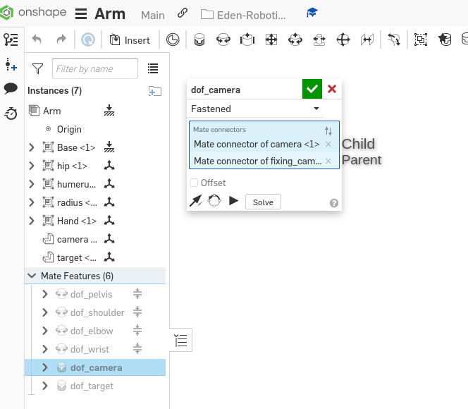

# Hardware

You can find the model here : [Onshape_model]([aa](https://cad.onshape.com/documents/8404446994fd5ae1242a5d56/w/0f8ef10f6026ba3e07bbdb54/e/7486e3cb0086b1a441d11061?renderMode=0&uiState=634821da4cf1a846282decef)). You need an onshape acount to copy and modify it.

See the assembly instructions [here](./Assembly_Instructions.pdf)

## Design Rules

To keep a clean work environment, the following points should be respected:

- Name all parts with a specific name: it is the ID of the part and it has to be unique
- One subassembly by articulation: a subassembly contains all the parts of an articulation that have a fixed join between them
- One main assembly containing the motor links: the main assembly contains only the join that you want to see at the end. Usually, it is the dynamic join but it can be fixed to get a part separately.
- Assign material to each part: in Onshape, you precise the volumic mass, you need to pay attention in case you use PLA with a 3D printer. A part is never full at 100\% and you need to adapt the volumic mass to get the correct masS.
- Motor link in the main assembly needs to be named **dof_<link_name>**
- A relation between parent/child needs to be respected for every link: In Onshape, like all CAO software, there is a parent/child relation in every link. You really need to pay attention to this, it can be a source of many errors if you want to export your model. When you create a link, fixed or motorized, the first element you click on is the child. The second one is the father. You can then check the parent and the child as shown in the following image. It is therefore necessary to start from the origin to the end of the robot, respecting these relationships at the time of assembly.

### Parent Child

In Onshape, like all CAO software, there is a parent/child relation in every link. You really need to pay attention to this, it can be source of many errors if you want to export your model.

When you create a link, fixed or motorized, the first element you click on is the child. The second one is the father. You can then check the parent and the child as shown in the following image.

<figure>
    
    <figcaption>Figure 1: Parent Child relation Onshape</figcaption>
</figure>

## Kinematics

 A schema has been created thanks to sketck lib.
 
## Gmesh

This folder contains a try to create a tool to create easy stl shape from picture or drawing. However, it is still in progress.

## Useful links

- [sketch_lib_documentation](http://alexdu.github.io/sketch-lib/)

