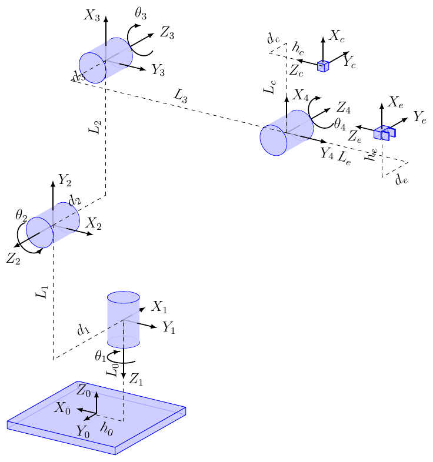

# Kinematics

Despite the use of matlab for the kinematics of the robot, a part has also been developed under python to facilitate its use.

The kinematic diagram of the robot is as follows

<figure>
    
    <figcaption>Figure 1 : Kinematics schema</figcaption>
</figure>

The [parameters](./parameters.py) file contains all the variables and the initial configuration of the end effector and the camera. It contains the screw axis. All variables were measured in the state and the body frame.

The forward kinematics as been computed in both.

## Useful links

- [modern_robotics_documentation](http://modernrobotics.org)
- [modern_robotics_github](https://github.com/NxRLab/ModernRobotics)
- [modern_robotics_coding_manual](https://github.com/NxRLab/ModernRobotics/blob/master/doc/MRlib.pdf)
- [coursera_classes_modern_robotics](https://www.coursera.org/learn/modernrobotics-course1)
