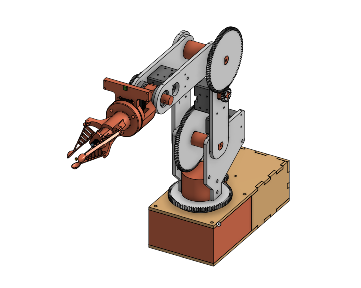

# Eden_Robotics

Eden Robotics is a student project. The objective was to create a robotic arm capable of harvesting tomatoes.

<figure>
    
    <figcaption>Figure 1 : Robot Visualitaion</figcaption>
</figure>

 
 
 

<figure>
    
    <figcaption>Figure 2 : Kinematics schema</figcaption>
</figure>

## Hardware

We used the following hardware part :

- dynamixels motors and driver : U2D2, XL430,XC430, XM430,AX12W
- Raspberry pi 3
- USB camera

To construct the robot, the parts are in this [folder](./Hardware/stl). A notice can be found [there](./Hardware/Assembly_Plan.pdf). You can also found the Onshape model [here](https://cad.onshape.com/documents/8404446994fd5ae1242a5d56/w/0f8ef10f6026ba3e07bbdb54/e/7486e3cb0086b1a441d11061?renderMode=0&uiState=634821da4cf1a846282decef).

We used Onshape to model the robot. Some rules, stated [here](./Hardware/README.md), must be respected during this creation. Thanks to this, a URDF model of the robot can be generated automatically (cf python part)

## Python

Each subfolder has a README file that explains more precisely how to use it.

### URDF

Using python, we transfer our Onshape model into an urdf model.

For more information see the [urdf_README](./Python/urdf/README.md).

### kinematics

Even if the inverse kinematics is done  in Matlab, some kinematics tools were done in python using modern_robotics library. Mainly because it facilitated the creation of node ROS and accelerated the process.

We used this library for :

- Forward kinematics
- compute configuration matrix of the end effector and the camera
- change point reference frame

For more information see the [kinematics_README](./Python/kinematics/README.md).

### Vision

Using openCV we have perfom :

- camera video display
- object tracking

For more information see the [vision_README](./Python/vision/README.md).

## Matlab

Thanks to the urdf file, it is possible to create a simscape multibody model of the robot.

Using matlab, we have perform:

- Forware kinematics
- Inverse kinematics
- closed loop model

For more information see the [matlab_README](./Matlab/README.md).

## Software

During the project, we used the following softwares :

- Matlab R2022a : ROS toolbox, Robotic system toolbox, simscape
- Python 3.8 : onshape-to-robot, modern robotics, openCV
- Ubuntu 20.04
- Onshape

## Useful links

- [eden_robotics_ros](https://github.com/AlessandriniAntoine/eden_robotics_ros.git) : branch ros1, package ros for this project
- [onshape-to-robot_documentation](https://onshape-to-robot.readthedocs.io/en/latest/)
- [modern_robotics_documentation](http://modernrobotics.org)
- [modern_robotics_github](https://github.com/NxRLab/ModernRobotics)
